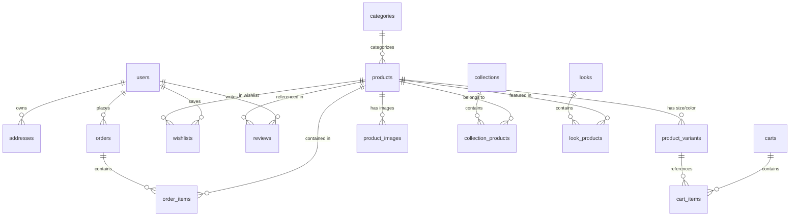

# GRABB-IT Clothing Database Architecture

This document describes the SQLite relational database schema utilized by the GRABB-IT Clothing application. The database is persistent in a single file located at [grabb_it.db](file:///C:/Users/mv240/.gemini/antigravity/scratch/server/database/grabb_it.db) and uses the `better-sqlite3` driver.

---

## Entity Relationship Overview

The database contains 15 tables that manage customer authentication, product catalog categorization, custom fashion campaigns, cart storage, order histories, review comments, and marketing promo codes.

---

## Detailed Table Specifications

### 1. `users`
Persists customer and administrator credentials.
- `id` (INTEGER, Primary Key): Auto-incremented identifier.
- `name` (TEXT, Not Null): User's full name.
- `email` (TEXT, Unique, Not Null): Account email address.
- `password_hash` (TEXT, Not Null): Securely hashed password (Bcrypt).
- `role` (TEXT, Default 'customer'): Security level, e.g. `'admin'` or `'customer'`.
- `phone` (TEXT, Nullable): Direct contact number.
- `created_at` (DATETIME): Registration timestamp.

### 2. `addresses`
Stores delivery details for users (1-to-many relationship with `users`).
- `id` (INTEGER, Primary Key): Auto-incremented address ID.
- `user_id` (INTEGER, Not Null): Foreign Key referencing `users(id)` (ON DELETE CASCADE).
- `full_name` (TEXT, Not Null): Consignee name.
- `phone` (TEXT, Not Null): Delivery contact number.
- `address_line` (TEXT, Not Null): House/flat number and street location.
- `city` (TEXT, Not Null): City.
- `state` (TEXT, Not Null): State name.
- `pincode` (TEXT, Not Null): 6-digit postal code.
- `is_default` (INTEGER, Default 0): Set to `1` if this is the default shipping destination.
- `created_at` (DATETIME): Timestamp when added.

### 3. `categories`
Organizes products by fashion group and target audience.
- `id` (INTEGER, Primary Key): Category ID.
- `name` (TEXT, Not Null): Readable name, e.g., "Oversized Tee".
- `slug` (TEXT, Unique, Not Null): URL-friendly string.
- `gender` (TEXT, Not Null): Targets either `'men'` or `'women'`.
- `image_url` (TEXT, Nullable): Category card background display image.
- `display_order` (INTEGER, Default 0): Ordering priority in menus.
- `is_active` (INTEGER, Default 1): Availability toggle (`1` for visible, `0` for hidden).
- `created_at` (DATETIME): Creation timestamp.

### 4. `products`
The main apparel directory table.
- `id` (INTEGER, Primary Key): Product ID.
- `name` (TEXT, Not Null): Display title.
- `slug` (TEXT, Unique, Not Null): URL-friendly locator slug.
- `description` (TEXT, Nullable): Editorial details.
- `gender` (TEXT, Not Null): Scoped to `'men'` or `'women'`.
- `category_id` (INTEGER, Not Null): Foreign Key referencing `categories(id)` (ON DELETE CASCADE).
- `price` (REAL, Not Null): Standard MRP price (INR).
- `sale_price` (REAL, Nullable): Selling price if discounted.
- `sku` (TEXT, Unique, Not Null): Unique Stock Keeping Unit.
- `rating` (REAL, Default 4.5): Calculated rating.
- `review_count` (INTEGER, Default 0): Review counter.
- `is_new` (INTEGER, Default 0): New Arrivals banner flag.
- `is_trending` (INTEGER, Default 0): Trending carousel flag.
- `is_featured` (INTEGER, Default 0): Curated section flag.
- `is_active` (INTEGER, Default 1): Toggle for public store availability.
- `display_order` (INTEGER, Default 0): Catalog sorting index.
- `created_at` (DATETIME): Timestamp.
- `updated_at` (DATETIME): Modification timestamp.

### 5. `product_variants`
Tracks stock levels per specific color-size combo (1-to-many relationship with `products`).
- `id` (INTEGER, Primary Key): Variant ID.
- `product_id` (INTEGER, Not Null): Foreign Key referencing `products(id)` (ON DELETE CASCADE).
- `size` (TEXT, Not Null): e.g. `'XS'`, `'S'`, `'M'`, `'L'`, `'XL'`, `'XXL'`, `'XXXL'`.
- `color` (TEXT, Not Null): e.g. `'Beige'`, `'Charcoal'`.
- `color_hex` (TEXT, Default '#000000'): CSS hex swatch representation.
- `stock` (INTEGER, Default 0): Active inventory count.

### 6. `product_images`
Contains supplementary photos for product galleries.
- `id` (INTEGER, Primary Key): Image entry ID.
- `product_id` (INTEGER, Not Null): Foreign Key referencing `products(id)` (ON DELETE CASCADE).
- `image_url` (TEXT, Not Null): File source path.
- `is_primary` (INTEGER, Default 0): Tag for main thumbnail display (`1` for primary, `0` otherwise).
- `display_order` (INTEGER, Default 0): Image presentation sequence index.

### 7. `banners`
Home campaign carousel controls.
- `id` (INTEGER, Primary Key): Banner ID.
- `title` (TEXT, Not Null): Main header text.
- `subtitle` (TEXT, Nullable): Secondary copy text.
- `button_text` (TEXT, Default 'SHOP NOW'): Action button label.
- `button_link` (TEXT, Default '/men'): Target click path.
- `image_url` (TEXT, Not Null): Large desktop graphic.
- `mobile_image_url` (TEXT, Nullable): Mobile layout graphic.
- `gender` (TEXT, Nullable): Scopes banner to `'men'`, `'women'`, or unisex (`NULL`).
- `display_order` (INTEGER, Default 0): Presentation ordering index.
- `is_active` (INTEGER, Default 1): Active flag.
- `start_date` (DATETIME): Scheduled start.
- `end_date` (DATETIME): Scheduled expiry.
- `created_at` (DATETIME): Creation date.

### 8. `carts`
Handles active carts for guest session trackers or logged-in users.
- `id` (INTEGER, Primary Key): Cart ID.
- `user_id` (INTEGER, Unique, Nullable): Links to `users(id)` if authenticated.
- `session_id` (TEXT, Unique, Nullable): Links to a guest browser tracking token.
- `created_at` (DATETIME): Creation date.
- `updated_at` (DATETIME): Last modification time.

### 9. `cart_items`
Apparel quantities reserved in active shopping bags (1-to-many with `carts`).
- `id` (INTEGER, Primary Key): Item ID.
- `cart_id` (INTEGER, Not Null): Reference to `carts(id)` (ON DELETE CASCADE).
- `product_id` (INTEGER, Not Null): Reference to `products(id)`.
- `variant_id` (INTEGER, Not Null): Reference to `product_variants(id)`.
- `quantity` (INTEGER, Default 1): Quantity of the selected item.

### 10. `wishlists`
Stores items favorited by users (1-to-many relationship with `users` and `products`).
- `id` (INTEGER, Primary Key): Wishlist ID.
- `user_id` (INTEGER, Not Null): Reference to `users(id)` (ON DELETE CASCADE).
- `product_id` (INTEGER, Not Null): Reference to `products(id)` (ON DELETE CASCADE).
- `created_at` (DATETIME): Saved timestamp.
- Unique constraints: `(user_id, product_id)` combination is unique.

### 11. `coupons`
Promo offers and discounts.
- `id` (INTEGER, Primary Key): Coupon ID.
- `code` (TEXT, Unique, Not Null): e.g. `'WELCOME500'`.
- `discount_type` (TEXT, Not Null): `'percentage'` or `'fixed'`.
- `discount_value` (REAL, Not Null): Percentage off (e.g. `20` for 20%) or flat currency off.
- `min_order_amount` (REAL, Default 0): Required order threshold in INR.
- `expiry_date` (DATETIME, Nullable): Date coupon expires.
- `usage_limit` (INTEGER, Default 100): Maximum allowable redemptions.
- `times_used` (INTEGER, Default 0): Redemptions counter.
- `is_active` (INTEGER, Default 1): Activation toggle.
- `created_at` (DATETIME): Setup timestamp.

### 12. `orders`
Complete history record of finalized sales transactions.
- `id` (INTEGER, Primary Key): Order entry ID.
- `order_number` (TEXT, Unique, Not Null): Randomized, human-readable reference number, e.g. `'GRB170564'`.
- `user_id` (INTEGER, Nullable): Reference to `users(id)` (ON DELETE SET NULL).
- `customer_name` (TEXT, Not Null): Checkout recipient name.
- `email` (TEXT, Not Null): Checkout correspondence email.
- `phone` (TEXT, Not Null): Delivery phone number.
- `shipping_address` (TEXT, Not Null): Full shipping address.
- `subtotal` (REAL, Not Null): Item prices sum.
- `discount_amount` (REAL, Default 0): Subtracted promo discount.
- `shipping_fee` (REAL, Default 0): Pincode shipping fee.
- `total_amount` (REAL, Not Null): Total checkout fee paid.
- `payment_method` (TEXT): Payment method used (e.g., `'UPI'`, `'Credit Card'`).
- `payment_status` (TEXT, Default 'Paid'): Paid state.
- `order_status` (TEXT, Default 'Pending'): Delivery steps, e.g. `'Pending'`, `'Confirmed'`, `'Processing'`, `'Shipped'`, `'Delivered'`, `'Cancelled'`, `'Returned'`.
- `tracking_number` (TEXT, Nullable): Carrier tracking number.
- `created_at` (DATETIME): Order timestamp.
- `updated_at` (DATETIME): Modification timestamp.

### 13. `order_items`
Stores the snapshot records of products purchased (1-to-many relationship with `orders`).
- `id` (INTEGER, Primary Key): Order item ID.
- `order_id` (INTEGER, Not Null): Reference to `orders(id)` (ON DELETE CASCADE).
- `product_id` (INTEGER, Nullable): Reference to `products(id)` (ON DELETE SET NULL).
- `product_name` (TEXT, Not Null): Snapshotted item name.
- `size` (TEXT, Not Null): Snapshotted size.
- `color` (TEXT, Not Null): Snapshotted color name.
- `price` (REAL, Not Null): Purchase unit price.
- `quantity` (INTEGER, Not Null): Ordered quantity.
- `image_url` (TEXT, Nullable): Thumbnail image path.

### 14. `reviews`
Allows customers to leave rating and comment feedback for products.
- `id` (INTEGER, Primary Key): Review ID.
- `product_id` (INTEGER, Not Null): Reference to `products(id)` (ON DELETE CASCADE).
- `user_id` (INTEGER, Not Null): Reference to `users(id)` (ON DELETE CASCADE).
- `user_name` (TEXT, Not Null): Reviewer profile name.
- `rating` (INTEGER, Check 1-5): Numeric score from `1` (lowest) to `5` (highest).
- `comment` (TEXT, Not Null): Written comments.
- `is_moderated` (INTEGER, Default 1): Review moderation toggle (`1` for approved, `0` for hidden).
- `created_at` (DATETIME): Submission timestamp.

### 15. `collections`
Curated groups of products for active marketing drops.
- `id` (INTEGER, Primary Key): Collection ID.
- `name` (TEXT, Not Null): Collection title, e.g., "The Everyday Edit".
- `slug` (TEXT, Unique, Not Null): Target landing URL slug.
- `description` (TEXT, Nullable): Editorial subtitle text.
- `cover_image` (TEXT, Nullable): Square grid thumbnail.
- `banner_image` (TEXT, Nullable): Horizontal display banner.
- `gender` (TEXT, Not Null): Scope tag, e.g., `'men'`, `'women'`, or `'unisex'`.
- `is_active` (INTEGER, Default 1): Active/inactive drop.
- `start_date` (DATETIME, Nullable): Campaign release date.
- `end_date` (DATETIME, Nullable): Expiry scheduling date.
- `created_at` (DATETIME): Creation timestamp.

### 16. `collection_products`
Many-to-many relationship mapping table between `collections` and `products`.
- `collection_id` (INTEGER, Foreign Key referencing `collections(id)` ON DELETE CASCADE).
- `product_id` (INTEGER, Foreign Key referencing `products(id)` ON DELETE CASCADE).
- Primary Key is the composite `(collection_id, product_id)`.

### 17. `looks`
Fashion inspiration catalog combinations.
- `id` (INTEGER, Primary Key): Look ID.
- `name` (TEXT, Not Null): Look style name.
- `description` (TEXT, Nullable): Editorial style commentary.
- `image_url` (TEXT, Not Null): Outfit photo URL.
- `gender` (TEXT, Not Null): Scoped targets `'men'` or `'women'`.
- `is_active` (INTEGER, Default 1): Selection status toggle.
- `created_at` (DATETIME): Creation timestamp.

### 18. `look_products`
Many-to-many mapping table between `looks` and `products`.
- `look_id` (INTEGER, Foreign Key referencing `looks(id)` ON DELETE CASCADE).
- `product_id` (INTEGER, Foreign Key referencing `products(id)` ON DELETE CASCADE).
- Composite Primary Key `(look_id, product_id)`.
